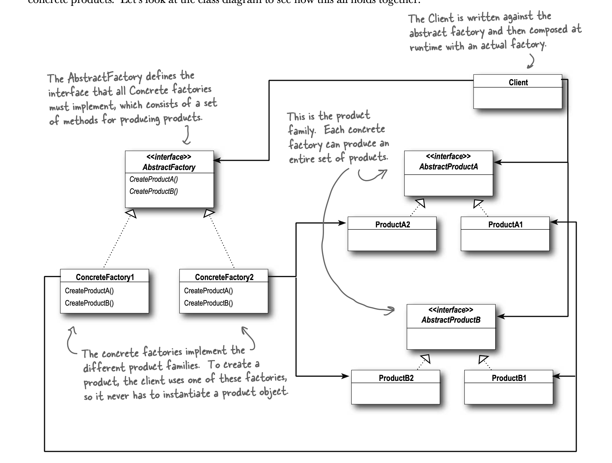

Intent : Provide interface for creating families of related or dependent objects without specifying their their conceretc class

motivation : 

- An Abstract Factory gives us an interface for creating a family of products.
- Uses this interface, we decouple our code from the actual factory that creates the products.

UML</img>