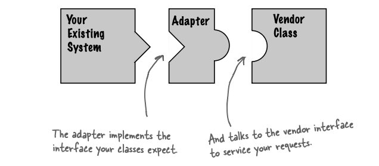
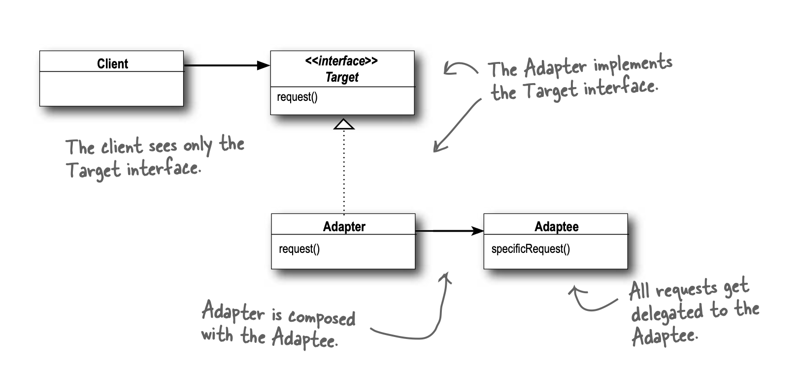

Intent: The Adapter Pattern converts the interface of a class into another interface the clients expect. Adapter lets classes work together that couldn’t otherwise because of incompatible interfaces.

Motivation: 
</img>

UML : 
</img>