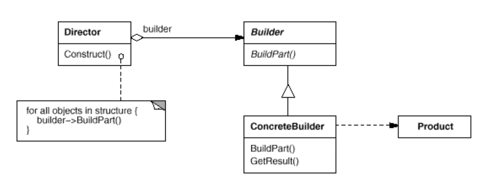

Intent :
 Separate the construction of complex object from it's representation so that the same construction process can create different representation.

refernece to this example:

1. construction of laptop parts are separated from laptop class
2. construction of parts is done in builder class of concrete class workingLaptopBuilder
3. director is responsible for input 

advanatge :

 UML</img>