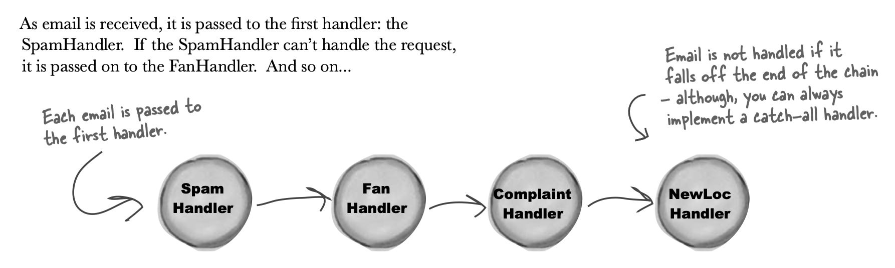
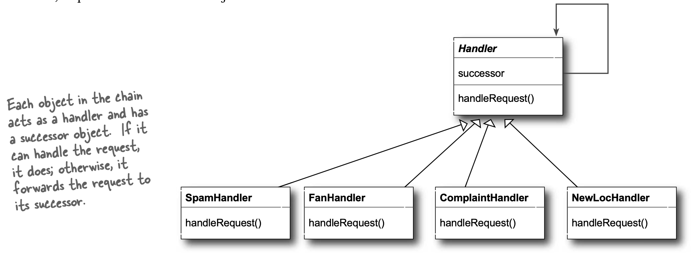

<b>Intent :</b>

Avoid coupling the sender of a request to its receiver by giving more than one object a chance to handle the request. Chain the receiving objects and pass the request along the chain until an object handles it.

<b>Motivation :</b>

The idea of this pattern is to decouple senders and receivers by giving multiple objects a chance to handle a request. The request gets passed along a chain of objects until one of them handles it.

- when there is herihacy of handler to handle request. 

Logical flow :
</img>

UML :
</img>