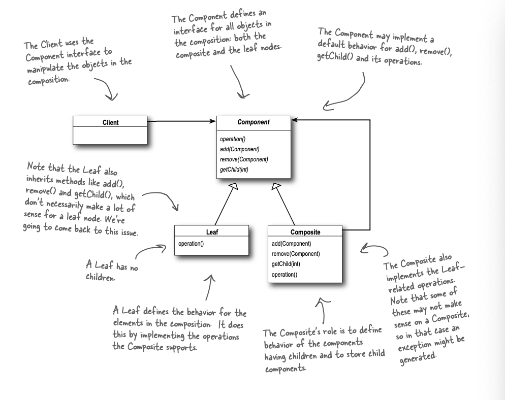

Intent: 

The Composite Pattern allows you to compose objects into tree structures to represent part-whole hierarchies. Composite lets clients treat individual objects and compositions of objects uniformly 

- collection of component in composite component

Refernece to example :
- The FileSystemComponent is abstract composite component
- The Directory is composite component
- The File is Leaf component
- getName() is the opreation method

UML :
</img>