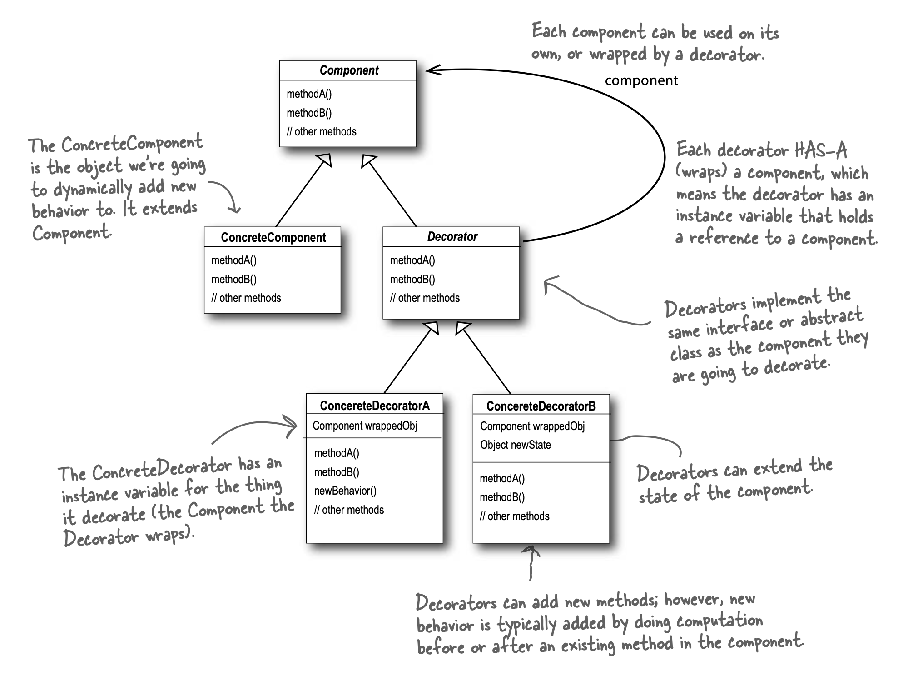

Intent :

 The decorator pattern atttaches additional responsibility to an <b>object dynamically</b>. Decorators provide a flexible alternative to subclassing for extending functionality.
 
- give addition functions to object during run time
- single reference to object

UML :
</img>
