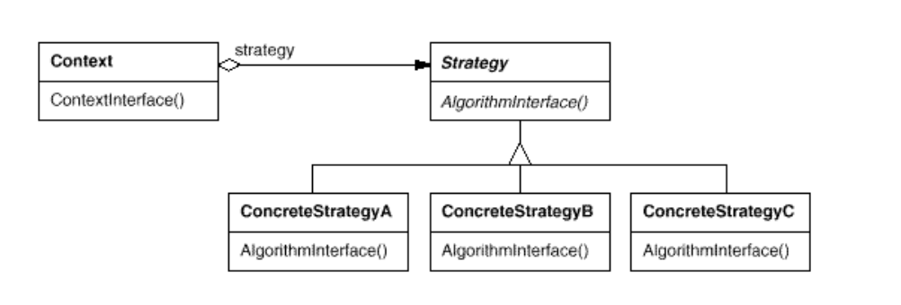

Intent :

- define a family of algorithms, encapsulate each one, and make them interchangeable
- Strategy lets the algorithm vary independently from clients that use it 
- Also know as Policy

</img>