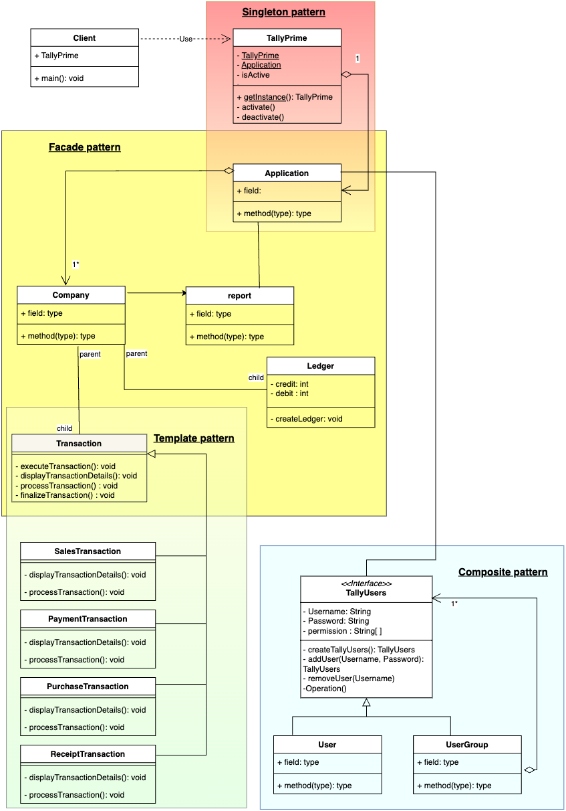

<h1>Topic : Implementing Tally Prime Simulation using design patterns in Java </h1> 

<h3>Problem Statement </h3>
<h4>Tally Prime is an advanced accounting software developed by Tally Solutions. It is designed to help businesses manage their financial operations more effectively. Designing a simplified version of Tally Prime using design patterns .  
</h4>
<h1>UML</h1>

<h1>Testing :</h1>  
License key: ABC123XYZ  
email: user1@example.com  
 
<b>Creating Admin user</b>  
user: aditya  
email: aditya@gmail.com  
password: 1234  
automatic permission set to admin User 
  
<b>Login User :</b>  
Username: aditya  
password: 1234  
 
<u>Note :</u> permission must be comma separated , no space before and after comma  
<b>Create userGroup with UserManagemnet:</b>  
Group Name: Finance  
User Group: root  
permissions: View Reports,Transactions,Create Company   
 
<b>Create user with UserManagemnet:</b>  

Username: suyog  
email: suyog@gmail.com  
password: 1234  
User Group : Finance  
permissions: View Reports,Transactions   

<b>Create user with UserManagemnet:</b>  
Username: ariyaan  
email: ariyaan@gmail.com  
password: 1234  
User Group :root
permissions:Transactions   

<b>Logout from main menu</b> 

<b>Login new user</b> 
UserName:  ariyaan  
Password: 1234

<b>Create Transactions:</b> 
select transaction from main menu 
1. Creating Sales Transaction 
2. Creating Purchase Transaction
3. Creating Payments Transaction
4. Creating Payment Transaction

 