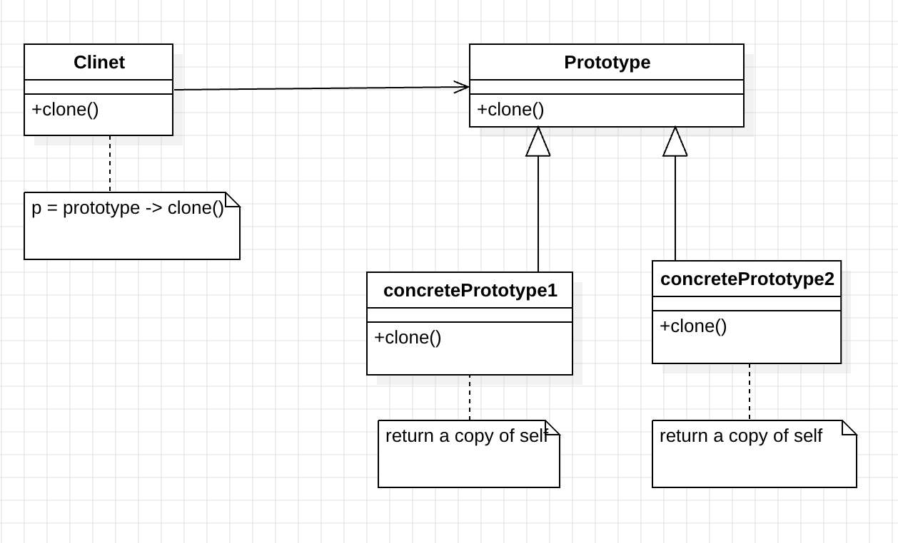

Intent: Specify the kinds of objects to create using a prototype instance and create new objects by copying this prototype.

motivation : in some situation , copying an existing object is more efficient than creating a new onject.

1. create a dictionary to store prototype
2. create prototypes
3. register prototype in dictionary
4. create clone with clone method 

The Prototype Pattern allows you to make new instances by copying existing instances

UML</img>